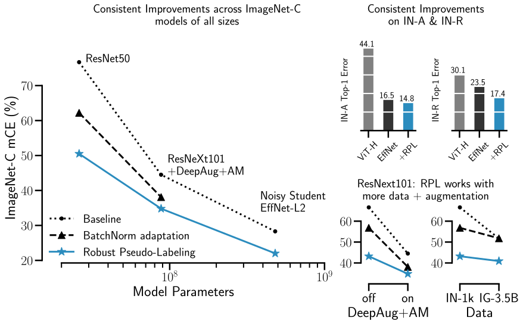

# Adapting ImageNet-scale models to complex distribution shifts with self-learning

Evgenia Rusak*, Steffen Schneider*, Peter Gehler, Oliver Bringmann, Matthias Bethge, Wieland Brendel

Website: [domainadaptation.org/selflearning](https://domainadaptation.org/selflearning)

This repository contains evaluation code for the paper [*Adapting ImageNet-scale models to complex distribution shifts with self-learning*](https://arxiv.org/abs/2104.12928).
We will release the code in the upcoming weeks. To get notified, watch and/or star this repository to get notified of updates!

While self-learning methods are an important component in many recent domain adaptation techniques, they are not yet comprehensively evaluated on ImageNet-scale datasets common in robustness research. In extensive experiments on ResNet and EfficientNet models, we find that three components are crucial for increasing performance with self-learning: (i) using short update times between the teacher and the student network, (ii) fine-tuning only few affine parameters distributed across the network, and (iii) leveraging methods from robust classification to counteract the effect of label noise. We use these insights to obtain drastically improved state-of-the-art results on ImageNet-C (22.0% mCE), ImageNet-R (17.4% error) and ImageNet-A (14.8% error). Our techniques yield further improvements in combination with previously proposed robustification methods. Self-learning is able to reduce the top-1 error to a point where no substantial further progress can be expected. We therefore re-purpose the dataset from the Visual Domain Adaptation Challenge 2019 and use a subset of it as a new robustness benchmark (ImageNet-D) which proves to be a more challenging dataset for all current state-of-the-art models (58.2% error) to guide future research efforts at the intersection of robustness and domain adaptation on ImageNet scale.

## Main results

## News

- The paper was accepted as a contributed talk to the [Weakly Supervised Learning Workshop](https://weasul.github.io/) @ICLR 2021.
